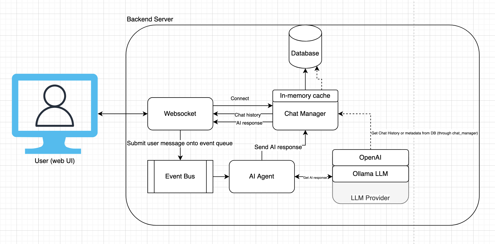

# AI Chat App

A minimal, event-driven AI chat application

# Architecture Diagram



---

# Requirements

  * Python 3.13 or newer
  * [uv](https://docs.astral.sh/uv/#installation) or [pip](https://pip.pypa.io/en/stable/)
  * [OpenAI](https://openai.com/) for remote LLM inference or [Ollama](https://ollama.com/) for local LLM inference

## Installation

Use the package manager [uv](https://docs.astral.sh/uv/#installation) or [pip](https://pip.pypa.io/en/stable/) to install requirements

```bash
uv pip install -r requirements.txt
```

## Usage

Run the application using uvicorn. By default, it will use OpenAI for LLM inference. Set your OpenAI API key in the `OPENAI_API_KEY` environment variable.  

```bash
# Set your OpenAI API key
export OPENAI_API_KEY=your_openai_api_key

# Run the application
uvicorn chat_app.main:app
```
If you want to use a local LLM running in Ollama, set the `USE_OLLAMA` flag and specify the model you want to use with the `LLM_MODEL` environment variable.

```bash
USE_OLLAMA=true LLM_MODEL=gemma3 uvicorn chat_app.main:app
```

## Testing
Run the tests using pytest

```bash
uv pip install -r requirements-test.txt

pytest --cov=chat_app --cov-report term-missing tests
```
